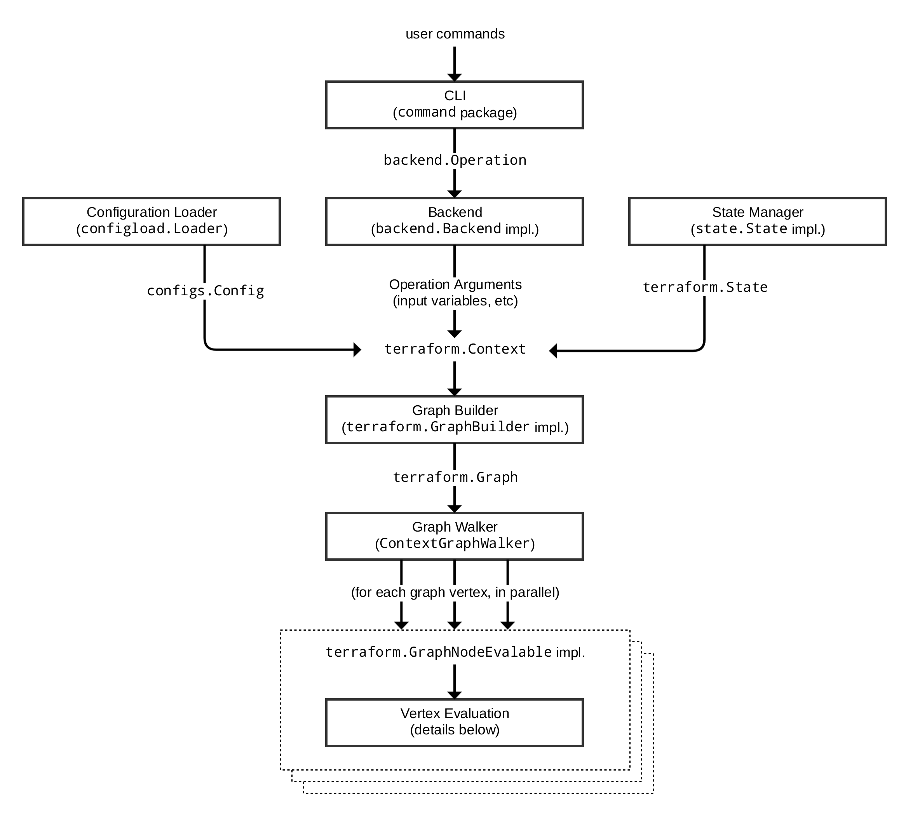

# Terraform Core Architecture Summary

This document is a summary of the main components of Terraform Core and how
data and requests flow between these components. It's intended as a primer
to help navigate the codebase to dig into more details.

We assume some familiarity with user-facing Terraform concepts like
configuration, state, CLI workflow, etc. The Terraform website has
documentation on these ideas.

## Terraform Request Flow

The following diagram shows an approximation of how a user command is
executed in Terraform:

Each of the different subsystems (solid boxes) in this diagram is described
in more detail in a corresponding section below.

## CLI (`command` package)

Each time a user runs the `terraform` program, aside from some initial
bootstrapping in the root package (not shown in the diagram) execution
transfers immediately into one of the "command" implementations in
[the `command` package](https://godoc.org/github.com/hashicorp/terraform/command).
The mapping between the user-facing command names and
their corresponding `command` package types can be found in the `commands.go`
file in the root of the repository.

The full flow illustrated above does not actually apply to _all_ commands,
but it applies to the main Terraform workflow commands `terraform plan` and
`terraform apply`, along with a few others.

For these commands, the role of the command implemtation is to read and parse
any command line arguments, command line options, and environment variables
that are needed for the given command and use them to produce a
[`backend.Operation`](https://godoc.org/github.com/hashicorp/terraform/backend#Operation)
object that describes an action to be taken.

An _operation_ consists of:

* The action to be taken (e.g. "plan", "apply").
* The name of the [workspace](https://www.terraform.io/docs/state/workspaces.html)
  where the action will be taken.
* Root module input variables to use for the action.
* For the "plan" operation, a path to the directory containing the configuration's root module.
* For the "apply" operation, the plan to apply.
* Various other less-common options/settings such as `-target` addresses, the
"force" flag, etc.

The operation is then passed to the currently-selected
[backend](https://www.terraform.io/docs/backends/index.html). Each backend name
corresponds to an implementation of
[`backend.Backend`](https://godoc.org/github.com/hashicorp/terraform/backend#Backend), using a
mapping table in
[the `backend/init` package](https://godoc.org/github.com/hashicorp/terraform/backend/init).

Backends that are able to execute operations additionally implement
[`backend.Enhanced`](https://godoc.org/github.com/hashicorp/terraform/backend#Enhanced);
the command-handling code calls `Operation` with the operation it has
constructed, and then the backend is responsible for executing that action.

Most backends do _not_ implement this interface, and so the `command` package
wraps these backends in an instance of
[`local.Local`](https://godoc.org/github.com/hashicorp/terraform/backend/local#Local),
causing the operation to be executed locally within the `terraform` process
itself, which (at the time of writing) is currently the only way an operation
can be executed.

## Backends

A _backend_ has a number of responsibilities in Terraform:

* Execute operations (e.g. plan, apply)
* Store state
* Store workspace-defined variables (in the future; not yet implemented)

As described above, the `local.Local` implementation -- named `local` from the
user's standpoint -- is the only backend which implements _all_ functionality.
Backends that cannot execute operations (at the time of writing, all except
`local`) can be wrapped inside `local.Local` to perform operations locally
while storing the [state](https://www.terraform.io/docs/state/index.html)
elsewhere.

To execute an operation locally, the `local` backend uses a _state manager_
(either
[`statemgr.Filesystem`](https://godoc.org/github.com/hashicorp/terraform/states/statemgr#Filesystem) if the
local backend is being used directly, or an implementation provided by whatever
backend is being wrapped) to retrieve the current state for the workspace
specified in the operation, then uses the _config loader_ to load and do
initial processing/validation of the configuration specified in the
operation. It then uses these, along with the other settings given in the
operation, to construct a
[`terraform.Context`](https://godoc.org/github.com/hashicorp/terraform/terraform#Context),
which is the main object that actually performs Terraform operations.

The `local` backend finally calls an appropriate method on that context to
begin execution of the relevant command, such as
[`Plan`](https://godoc.org/github.com/hashicorp/terraform/terraform#Context.Plan)
or
[`Apply`](), which in turn constructs a graph using a _graph builder_,
described in a later section.

## Configuration Loader

The top-level configuration structure is represented by model types in
[package `configs`](https://godoc.org/github.com/hashicorp/terraform/configs).
A whole configuration (the root module plus all of its descendent modules)
is represented by
[`configs.Config`](https://godoc.org/github.com/hashicorp/terraform/configs#Config).

The `configs` package contains some low-level functionality for constructing
configuration objects, but the main entry point is in the sub-package
[`configload`](https://godoc.org/github.com/hashicorp/terraform/configs/configload]),
via
[`configload.Loader`](https://godoc.org/github.com/hashicorp/terraform/configs/configload#Loader).
A loader deals with all of the details of installing child modules
(during `terraform init`) and then locating those modules again when a
configuration is loaded by a backend. It takes the path to a root module
and recursively loads all of the child modules to produce a single
[`configs.Config`](https://godoc.org/github.com/hashicorp/terraform/configs#Config)
representing the entire configuration.

Terraform expects configuration files written in the Terraform language, which
is a DSL built on top of
[HCL](https://github.com/hashicorp/hcl2). Some parts of the configuration
cannot be interpreted until we build and walk the graph, since they depend
on the outcome of other parts of the configuration, and so these parts of
the configuration remain represented as the low-level HCL types
[hcl.Body](https://godoc.org/github.com/hashicorp/hcl2/hcl#Body)
and
[hcl.Expression](https://godoc.org/github.com/hashicorp/hcl2/hcl#Expression),
allowing Terraform to interpret them at a more appropriate time.

## State Manager

A _state manager_ is responsible for storing and retrieving snapshots of the
[Terraform state](https://www.terraform.io/docs/state/index.html)
for a particular workspace. Each manager is an implementation of
some combination of interfaces in
[the `statemgr` package](https://godoc.org/github.com/hashicorp/terraform/states/statemgr),
with most practical managers implementing the full set of operations
described by
[`statemgr.Full`](https://godoc.org/github.com/hashicorp/terraform/states/statemgr#Full)
provided by a _backend_. The smaller interfaces exist primarily for use in
other function signatures to be explicit about what actions the function might
take on the state manager; there is little reason to write a state manager
that does not implement all of `statemgr.Full`.

The implementation
[`statemgr.Filesystem`](https://godoc.org/github.com/hashicorp/terraform/states/statemgr#Filesystem) is used
by default (by the `local` backend) and is responsible for the familiar
`terraform.tfstate` local file that most Terraform users start with, before
they switch to [remote state](https://www.terraform.io/docs/state/remote.html).
Other implementations of `statemgr.Full` are used to implement remote state.
Each of these saves and retrieves state via a remote network service
appropriate to the backend that creates it.

A state manager accepts and returns a state snapshot as a
[`states.State`](https://godoc.org/github.com/hashicorp/terraform/states#State)
object. The state manager is responsible for exactly how that object is
serialized and stored, but all state managers at the time of writing use
the same JSON serialization format, storing the resulting JSON bytes in some
kind of arbitrary blob store.

## Graph Builder

A _graph builder_ is called by a
[`terraform.Context`](https://godoc.org/github.com/hashicorp/terraform/terraform#Context)
method (e.g. `Plan` or `Apply`) to produce the graph that will be used
to represent the necessary steps for that operation and the dependency
relationships between them.

In most cases, the
[vertices](https://en.wikipedia.org/wiki/Vertex_(graph_theory)) of Terraform's
graphs each represent a specific object in the configuration, or something
derived from those configuration objects. For example, each `resource` block
in the configuration has one corresponding
[`GraphNodeResource`](https://godoc.org/github.com/hashicorp/terraform/terraform#GraphNodeResource)
vertex representing it in the "plan" graph. (Terraform Core uses terminology
inconsistently, describing graph vertices also as graph nodes in various
places. These both describe the same concept.)

The [edges](https://en.wikipedia.org/wiki/Glossary_of_graph_theory_terms#edge)
in the graph represent "must happen after" relationships. These define the
order in which the vertices are evaluated, ensuring that e.g. one resource is
created before another resource that depends on it.

Each operation has its own graph builder, because the graph building process
is different for each. For example, a "plan" operation needs a graph built
directly from the configuration, but an "apply" operation instead builds its
graph from the set of changes described in the plan that is being applied.

The graph builders all work in terms of a sequence of _transforms_, which
are implementations of
[`terraform.GraphTransformer`](https://godoc.org/github.com/hashicorp/terraform/terraform#GraphTransformer).
Implementations of this interface just take a graph and mutate it in any
way needed, and so the set of available transforms is quite varied. Some
import examples include:

* [`ConfigTransformer`](https://godoc.org/github.com/hashicorp/terraform/terraform#ConfigTransformer),
  which creates a graph vertex for each `resource` block in the configuration.

* [`StateTransformer`](https://godoc.org/github.com/hashicorp/terraform/terraform#StateTransformer),
  which creates a graph vertex for each resource instance currently tracked
  in the state.

* [`ReferenceTransformer`](https://godoc.org/github.com/hashicorp/terraform/terraform#ReferenceTransformer),
  which analyses the configuration to find dependencies between resources and
  other objects and creates any necessary "happens after" edges for these.

* [`ProviderTransformer`](https://godoc.org/github.com/hashicorp/terraform/terraform#ProviderTransformer),
  which associates each resource or resource instance with exactly one
  provider configuration (implementing
  [the inheritance rules](https://www.terraform.io/docs/modules/usage.html#providers-within-modules))
  and then creates "happens after" edges to ensure that the providers are
  initialized before taking any actions with the resources that belong to
  them.

There are many more different graph transforms, which can be discovered
by reading the source code for the different graph builders. Each graph
builder uses a different subset of these depending on the needs of the
operation that is being performed.

The result of graph building is a
[`terraform.Graph`](https://godoc.org/github.com/hashicorp/terraform/terraform#Graph), which
can then be processed using a _graph walker_.

## Graph Walk

The process of walking the graph visits each vertex of that graph in a way
which respects the "happens after" edges in the graph. The walk algorithm
itself is implemented in
[the low-level `dag` package](https://godoc.org/github.com/hashicorp/terraform/dag#AcyclicGraph.Walk)
(where "DAG" is short for [_Directed Acyclic Graph_](https://en.wikipedia.org/wiki/Directed_acyclic_graph)), in
[`AcyclicGraph.Walk`](https://godoc.org/github.com/hashicorp/terraform/dag#AcyclicGraph.Walk).
However, the "interesting" Terraform walk functionality is implemented in
[`terraform.ContextGraphWalker`](https://godoc.org/github.com/hashicorp/terraform/terraform#ContextGraphWalker),
which implements a small set of higher-level operations that are performed
during the graph walk:

* `EnterPath` is called once for each module in the configuration, taking a
  module address and returning a
  [`terraform.EvalContext`](https://godoc.org/github.com/hashicorp/terraform/terraform#EvalContext)
  that tracks objects within that module. `terraform.Context` is the _global_
  context for the entire operation, while `terraform.EvalContext` is a
  context for processing within a single module, and is the primary means
  by which the namespaces in each module are kept separate.

* `EnterEvalTree` and `ExitEvalTree` are each called once for each vertex
  in the graph during _vertex evaluation_, which is described in the following
  section.

Each vertex in the graph is evaluated, in an order that guarantees that the
"happens after" edges will be respected. If possible, the graph walk algorithm
will evaluate multiple vertices concurrently. Vertex evaluation code must
therefore make careful use of concurrency primitives such as mutexes in order
to coordinate access to shared objects such as the `states.State` object.
In most cases, we use the helper wrapper
[`states.SyncState`](https://godoc.org/github.com/hashicorp/terraform/states#SyncState)
to safely implement concurrent reads and writes from the shared state.

## Vertex Evaluation

The action taken for each vertex during the graph walk is called
_evaluation_. Evaluation runs a sequence of arbitrary actions that make sense
for a particular vertex type.

For example, evaluation of a vertex representing a resource instance during
a plan operation would include the following high-level steps:

* Retrieve the resource's associated provider from the `EvalContext`. This
  should already be initialized earlier by the provider's own graph vertex,
  due to the "happens after" edge between the resource node and the provider
  node.

* Retrieve from the state the portion relevant to the specific resource
  instance being evaluated.

* Evaluate the attribute expressions given for the resource in configuration.
  This often involves retrieving the state of _other_ resource instances so
  that their values can be copied or transformed into the current instance's
  attributes, which is coordinated by the `EvalContext`.

* Pass the current instance state and the resource configuration to the
  provider, asking the provider to produce an _instance diff_ representing the
  differences between the state and the configuration.

* Save the instance diff as part of the plan that is being constructed by
  this operation.

Each evaluation step for a vertex is an implementation of
[`terraform.EvalNode`](https://godoc.org/github.com/hashicorp/terraform/terraform#EvalNode).
As with graph transforms, the behavior of these implementations varies widely:
whereas graph transforms can take any action against the graph, an `EvalNode`
implementation can take any action against the `EvalContext`.

The implementation of `terraform.EvalContext` used in real processing
(as opposed to testing) is
[`terraform.BuiltinEvalContext`](https://godoc.org/github.com/hashicorp/terraform/terraform#BuiltinEvalContext).
It provides coordinated access to plugins, the current state, and the current
plan via the `EvalContext` interface methods.

In order to be evaluated, a vertex must implement
[`terraform.GraphNodeEvalable`](https://godoc.org/github.com/hashicorp/terraform/terraform#GraphNodeEvalable),
which has a single method that returns an `EvalNode`. In practice, most
implementations return an instance of
[`terraform.EvalSequence`](https://godoc.org/github.com/hashicorp/terraform/terraform#EvalSequence),
which wraps a number of other `EvalNode` objects to be executed in sequence.

There are numerous `EvalNode` implementations with different behaviors, but
some prominent examples are:

* [`EvalReadState`](https://godoc.org/github.com/hashicorp/terraform/terraform#EvalReadState),
  which extracts the data for a particular resource instance from the state.

* [`EvalWriteState`](https://godoc.org/github.com/hashicorp/terraform/terraform#EvalWriteState),
  which conversely replaces the data for a particular resource instance in
  the state with some updated data resulting from changes made by the
  provider.

* [`EvalInitProvider`](https://godoc.org/github.com/hashicorp/terraform/terraform#EvalInitProvider),
  which starts up a provider plugin and passes the user-provided configuration
  to it, caching the provider inside the `EvalContext`.

* [`EvalGetProvider`](https://godoc.org/github.com/hashicorp/terraform/terraform#EvalGetProvider),
  which retrieves an already-initialized provider that is cached in the
  `EvalContext`.

* [`EvalValidateResource`](https://godoc.org/github.com/hashicorp/terraform/terraform#EvalValidateResource),
  which checks to make sure that resource configuration conforms to the
  expected schema and gives a provider plugin the opportunity to check that
  given values are within the expected range, etc.

* [`EvalApply`](https://godoc.org/github.com/hashicorp/terraform/terraform#EvalApply),
  which calls into a provider plugin to make apply some planned changes
  to a given resource instance.

All of the evaluation steps for a vertex must complete successfully before
the graph walk will begin evaluation for other vertices that have
"happens after" edges. Evaluation can fail with one or more errors, in which
case the graph walk is halted and the errors are returned to the user.

### Expression Evaluation

An important part of vertex evaluation for most vertex types is evaluating
any expressions in the configuration block associated with the vertex. This
completes the processing of the portions of the configuration that were not
processed by the configuration loader.

The high-level process for expression evaluation is:

1. Analyze the configuration expressions to see which other objects they refer
  to. For example, the expression `aws_instance.example[1]` refers to one of
  the instances created by a `resource "aws_instance" "example"` block in
  configuration. This analysis is performed by
  [`lang.References`](https://godoc.org/github.com/hashicorp/terraform/lang#References),
  or more often one of the helper wrappers around it:
  [`lang.ReferencesInBlock`](https://godoc.org/github.com/hashicorp/terraform/lang#ReferencesInBlock)
  or
  [`lang.ReferencesInExpr`](https://godoc.org/github.com/hashicorp/terraform/lang#ReferencesInExpr)

2. Retrieve from the state the data for the objects that are referred to and
  create a lookup table of the values from these objects that the
  HCL evaluation code can refer to.

3. Prepare the table of built-in functions so that HCL evaluation can refer to
  them.

4. Ask HCL to evaluate each attribute's expression (a `hcl.Expression` object)
  against the data and function lookup tables.

In practice, steps 2 through 4 are usually run all together using one
of the methods on [`lang.Scope`](https://godoc.org/github.com/hashicorp/terraform/lang#Scope);
most commonly,
[`lang.EvalBlock`](https://godoc.org/github.com/hashicorp/terraform/lang#Scope.EvalBlock)
or
[`lang.EvalExpr`](https://godoc.org/github.com/hashicorp/terraform/lang#Scope.EvalExpr).

Expression evaluation produces a dynamic value represented as a
[`cty.Value`](https://godoc.org/github.com/zclconf/go-cty/cty#Value).
This Go type represents values from the Terraform language and such values
are eventually passed to provider plugins.

### Sub-graphs

Some vertices have a special additional behavior that happens after their
evaluation steps are complete, where the vertex implementation is given
the opportunity to build another separate graph which will be walked as part
of the evaluation of the vertex.

The main example of this is when a `resource` block has the `count` argument
set. In that case, the plan graph initially contains one vertex for each
`resource` block, but that graph then _dynamically expands_ to have a sub-graph
containing one vertex for each instance requested by the count. That is, the
sub-graph of `aws_instance.example` might contain vertices for
`aws_instance.example[0]`, `aws_instance.example[1]`, etc. This is necessary
because the `count` argument may refer to other objects whose values are not
known when the main graph is constructed, but become known while evaluating
other vertices in the main graph.

This special behavior applies to vertex objects that implement
[`terraform.GraphNodeDynamicExpandable`](https://godoc.org/github.com/hashicorp/terraform/terraform#GraphNodeDynamicExpandable). Such vertexes have their own nested _graph builder_, _graph walk_,
and _vertex evaluation_ steps, with the same behaviors as described in these
sections for the main graph. The difference is in which graph transforms
are used to construct the graph and in which evaluation steps apply to the
nodes in that sub-graph.

