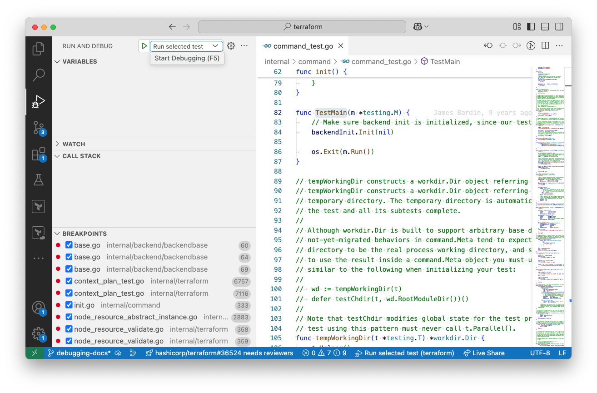
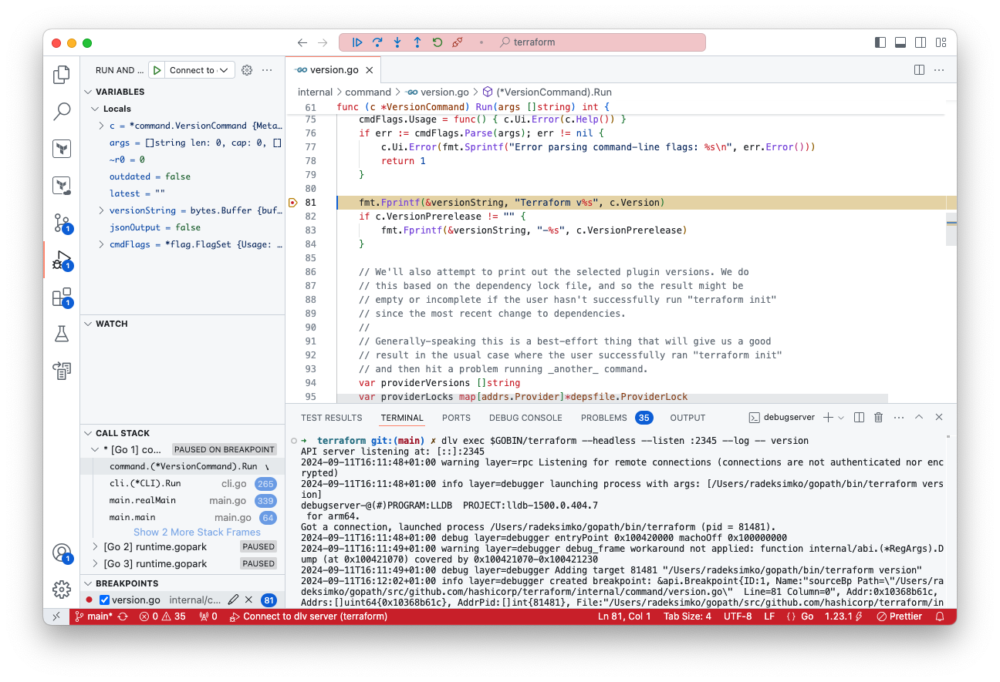

# How to Debug Terraform

Contents:
- [Debugging automated tests](#debugging-automated-tests)
    - [Debugging automated tests in VSCode](#debugging-automated-tests-in-vscode)
- [Debugging Terraform operations that use real Terraform configurations](#debugging-terraform-operations-that-use-real-terraform-configurations)
    - [Launch Terraform with the `dlv` CLI tool](#launch-terraform-with-the-dlv-cli-tool)
    - [Launch Terraform with VS Code's debugging tool](#launch-terraform-with-vs-codes-debugging-tool)


As Terraform is written in Go you may use [Delve](https://github.com/go-delve/delve) to debug it.

GoLand includes [debugging features](https://www.jetbrains.com/help/go/debugging-code.html), and the [Go extension for VS Code](https://code.visualstudio.com/docs/languages/go#_debugging) makes it easy to use Delve when debugging Go codebases in VS Code. 

## Debugging automated tests

Debugging an automated test is often the most straightforward workflow for debugging a section of the codebase. For example, the Go extension for VS Code](https://code.visualstudio.com/docs/languages/go#_debugging) adds `run test | debug test` options above all tests in a `*_test.go` file. These allow debugging without any prior configuration.

### Debugging automated tests in VSCode

As described above, debugging tests in VS Code is easily achieved through the Go extension.

If you need more control over how tests are run while debugging, e.g. environment variable values, look at the [example debugger launch configuration 'Run selected test'](./debugging-configs/vscode/debug-automated-tests/launch.json). You can adapt this example to create your own [launch configuration file](https://code.visualstudio.com/docs/editor/debugging#_launch-configurations).

When using this launch configuration you must highlight a test's name before starting the debugger:

<p align="center">
    
</p>


## Debugging Terraform operations that use real Terraform configurations

### Launch Terraform with the `dlv` CLI tool

In this workflow you:
* Build Terraform using compiler flags.
* Start a debug server with a command containing the terraform command you want to debug.
    * This command is run in the working directory that contains your Terraform configuration.
* Connect to the debug server to monitor progress through breakpoints.

#### 1. Compile & Start Debug Server

One way to do it is to compile a binary with the [appropriate compiler flags](https://pkg.go.dev/cmd/compile#hdr-Command_Line):

```sh
go install -gcflags="all=-N -l"
```

This enables you to then execute the compiled binary via Delve, pass any arguments and spin up a debug server which you can then connect to:

```sh
# Update the path to the terraform binary if your install directory is influenced by $GOPATH or $GOBIN
dlv exec $HOME/go/bin/terraform --headless --listen :2345 --log -- apply
```

#### 2a. Connect via CLI

You may connect to the headless debug server via Delve CLI

```sh
dlv connect :2345
```

#### 2b. Connect from VS Code

The repository provides [an example 'Connect to dlv server' launch configuration](./debugging-configs/vscode/launch-via-cli/launch.json), making it possible to use VS Code's native debugging integration via the [Go extension for VS Code](https://code.visualstudio.com/docs/languages/go#_debugging):

<p align="center">
    
</p>


### Launch Terraform with VS Code's debugging tool

In this workflow you:
* Update the debugger's launch configuration to point at the directory containing your Terraform configuration.
* Start the debugger through VS Code and monitor progress through breakpoints.

#### 1. Update the debugger's launch configuration

Look at the [example debugger launch configuration 'Run Terraform in debug mode'](./debugging-configs/vscode/launch-from-vscode-debugger/launch.json). You can adapt this example to create your own [launch configuration file](https://code.visualstudio.com/docs/editor/debugging#_launch-configurations).

To use this launch configuration:
* Prepare a local Terraform project.
* Get the absolute path to that directory.
* Update the launch configuration to use that path, either in the `-chdir` argument or as a `cwd` attribute in the launch configuration.
* Make sure the `args` array's element reflect the command you'd like to debug.
* Provide any required environment variables through the `env` or `envFile` attributes.

#### 2. Run the launch configuration in VS Code

Navigate to the Run and Debug view in the left-side Activity Bar. After selecting the `Run Terraform in debug mode` configuration in the Run and Debug view from the left-side, press the green arrow.

This is equivalent to running a Terraform CLI command in the local Terraform project's directory. For example, if you run and debug a plan command that saves a plan file, that plan file will be created.

This workflow is useful if you need to set up a complicated prior state to replicate a bug or if you want to debug code behaviour given a specific configuration.