# Terraform Core Resource Destruction Notes

This document intends to describe some of the details and complications
involved in the destruction of resources. It covers the ordering defined for
related create and destroy operations, as well as changes to the lifecycle
ordering imposed by `create_before_destroy`. It is not intended to enumerate
all possible combinations of dependency ordering, only to outline the basics
and document some of the more complicated aspects of resource destruction.

The graph diagrams here will continue to use the inverted graph structure used
internally by Terraform, where edges represent dependencies rather than order
of operations. 

## Simple Resource Creation

In order to describe resource destruction, we first need to create the
resources and define their order. The order of creation is that which fulfills
the dependencies for each resource. In this example, `A` has no dependencies,
`B` depends on `A`, and `C` depends on `B`, and transitively depends on `A`.

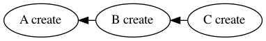
<!--
digraph create {
    subgraph nodes {
        rank=same;
        a [label="A create"];
        b [label="B create"];
        c [label="C create"];
        b -> c [dir=back];
        a -> b [dir=back];
    }
}
-->

Order of operations:
1. `A` is created
1. `B` is created
1. `C` is created

## Resource Updates

An existing resource may be updated with references to a newly created
resource. The ordering here is exactly the same as one would expect for
creation.

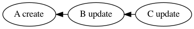
<!--
digraph update {
    subgraph nodes {
        rank=same;
        a [label="A create"];
        b [label="B update"];
        c [label="C update"];
        b -> c [dir=back];
        a -> b [dir=back];
    }
}
-->

Order of operations:
1. `A` is created
1. `B` is created
1. `C` is created

## Simple Resource Destruction

The order for destroying resource is exactly the inverse used to create them.
This example shows the graph for the destruction of the same nodes defined
above. While destroy nodes will not contain attribute references, we will
continue to use the inverted edges showing dependencies for destroy, so the
operational ordering is still opposite the flow of the arrows.

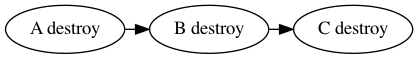
<!--
digraph destroy {
    subgraph nodes {
        rank=same;
        a [label="A destroy"];
        b [label="B destroy"];
        c [label="C destroy"];
        a -> b;
        b -> c;
    }
}
-->

Order of operations:
1. `C` is destroyed
1. `B` is destroyed
1. `A` is Destroyed

## Resource Replacement

Resource replacement is the logical combination of the above scenarios. Here we
will show the replacement steps involved when `B` depends on `A`.

In this first example, we simultaneously replace both `A` and `B`. Here `B` is
destroyed before `A`, then `A` is recreated before `B`.

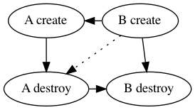
<!--
digraph replacement {
    subgraph create {
        rank=same;
        a [label="A create"];
        b [label="B create"];
        a -> b [dir=back];
    }
    subgraph destroy {
        rank=same;
        a_d [label="A destroy"];
        b_d [label="B destroy"];
        a_d -> b_d;
    }

    a -> a_d;
    a -> b_d [style=dotted];
    b -> a_d [style=dotted];
    b -> b_d;
}
-->

Order of operations:
1. `B` is destroyed
1. `A` is destroyed
1. `A` is created
1. `B` is created

This second example replaces only `A`, while updating `B`. Resource `B` is only
updated once `A` has been destroyed and recreated.

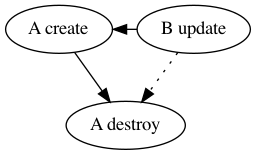
<!--
digraph replacement {
    subgraph create {
        rank=same;
        a [label="A create"];
        b [label="B update"];
        a -> b [dir=back];
    }
    subgraph destroy {
        rank=same;
        a_d [label="A destroy"];
    }

    a -> a_d;
    b -> a_d [style=dotted];
}
-->

Order of operations:
1. `A` is destroyed
1. `A` is created
1. `B` is updated

While the dependency edge from `B update` to `A destroy` isn't necessary in
these examples, it is shown here as an implementation detail which will be
mentioned later on.

A final example based on the replacement graph; starting with the above
configuration where `B` depends on `A`. The graph is reduced to an update of
`A` while only destroying `B`. The interesting feature here is the remaining
dependency of `A update` on `B destroy`. We can derive this ordering of
operations from the full replacement example above, by replacing `A create`
with `A update` and removing the unused nodes.

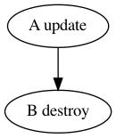
<!--
digraph destroy_then_update {
    subgraph update {
        rank=same;
        a [label="A update"];
    }
    subgraph destroy {
        rank=same;
        b_d [label="B destroy"];
    }

    a -> b_d;
}
-->
## Create Before Destroy

Currently, the only user-controllable method for changing the ordering of
create and destroy operations is with the `create_before_destroy` resource
`lifecycle` attribute. This has the obvious effect of causing a resource to be
created before it is destroyed when replacement is required, but has a couple
of other effects we will detail here.

Taking the previous replacement examples, we can change the behavior of `A` to
be that of `create_before_destroy`.

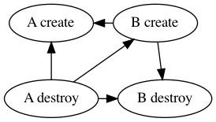
<!--
digraph replacement {
    subgraph create {
        rank=same;
        a [label="A create"];
        b [label="B create"];
        a -> b [dir=back];
    }
    subgraph destroy {
        rank=same;
        a_d [label="A destroy"];
        b_d [label="B destroy"];
        a_d -> b_d;
    }

    a -> a_d [dir=back];
    a -> b_d;
    b -> a_d [dir=back];
    b -> b_d;
}
-->

Order of operations:
1. `B` is destroyed
2. `A` is created
1. `B` is created
1. `A` is destroyed

Note that in this first example, the creation of `B` is inserted in between the
creation of `A` and the destruction of `A`. This becomes more important in the
update example below.

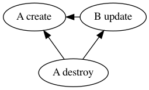
<!--
digraph replacement {
    subgraph create {
        rank=same;
        a [label="A create"];
        b [label="B update"];
        a -> b [dir=back];
    }
    subgraph destroy {
        rank=same;
        a_d [label="A destroy"];
    }

    a -> a_d [dir=back, style=dotted];
    b -> a_d [dir=back];
}
-->

Order of operations:
1. `A` is created
1. `B` is updated
1. `A` is destroyed

Here we can see clearly how `B` is updated after the creation of `A` and before
the destruction of the _deposed_ resource `A`. (The prior resource `A` is
sometimes referred to as "deposed" before it is destroyed, to disambiguate it
from the newly created `A`.) This ordering is important for resource that
"register" other resources, and require updating before the dependent resource
can be destroyed.

The transformation used to create these graphs is also where we use the extra
edges mentioned above connecting `B` to `A destroy`. The algorithm to change a
resource from the default ordering to `create_before_destroy` simply inverts
any incoming edges from other resources, which automatically creates the
necessary dependency ordering for dependent updates. This also ensures that
reduced versions of this example still adhere to the same ordering rules, such
as when the dependency is only being removed:

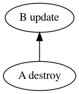
<!--
digraph update {
    subgraph create {
        rank=same;
        b [label="B update"];
    }
    subgraph destroy {
        rank=same;
        a_d [label="A destroy"];
    }

    b -> a_d [dir=back];
}
-->

Order of operations:
1. `B` is updated
1. `A` is destroyed

### Forced Create Before Destroy

In the previous examples, only resource `A` was being used as is it were
`create_before_destroy`. The minimal graphs used show that it works in
isolation, but that is only when the `create_before_destroy` resource has no
dependencies of it own. When a `create_before_resource` depends on another
resource, that dependency is "infected" by the `create_before_destroy`
lifecycle attribute.

This example demonstrates why forcing `create_before_destroy` is necessary. `B`
has `create_before_destroy` while `A` does not. If we only invert the ordering
for `B`, we can see that results in a cycle.

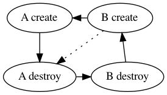
<!--
digraph replacement {
    subgraph create {
        rank=same;
        a [label="A create"];
        b [label="B create"];
        a -> b [dir=back];
    }
    subgraph destroy {
        rank=same;
        a_d [label="A destroy"];
        b_d [label="B destroy"];
        a_d -> b_d;
    }

    a -> a_d;
    a -> b_d [style=dotted];
    b -> a_d [style=dotted];
    b -> b_d [dir=back];
}
-->

In order to resolve these cycles, all resources that precede a resource
with `create_before_destroy` must in turn be handled in the same manner.
Reversing the incoming edges to `A destroy` resolves the problem:

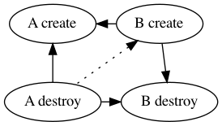
<!--
digraph replacement {
    subgraph create {
        rank=same;
        a [label="A create"];
        b [label="B create"];
        a -> b [dir=back];
    }
    subgraph destroy {
        rank=same;
        a_d [label="A destroy"];
        b_d [label="B destroy"];
        a_d -> b_d;
    }

    a -> a_d [dir=back];
    a -> b_d [dir=back, style=dotted];
    b -> a_d [dir=back, style=dotted];
    b -> b_d [dir=back];
}
-->

Order of operations:
1. `A` is created
1. `B` is created
1. `B` is destroyed
1. `A` is destroyed

This also demonstrates why `create_before_destroy` cannot be overridden when
it is inherited; changing the behavior here isn't possible without removing
the initial reason for `create_before_destroy`; otherwise cycles are always
introduced into the graph.
