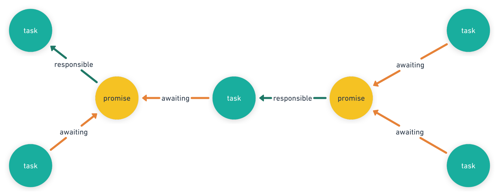

# Deadlock-free Promises

This directory contains the Go package `promising`, which is an implementation
of promises that guarantees that it cannot deadlock due to self-dependencies
or a failure to resolve.

This was created to support the internal evaluation of the Terraform Stacks
runtime, although there's nothing specific to Stacks in here and so it may
attract other callers over time.

## Overview

The functionality in this package is built around two key concepts:

- Promises: a placeholder for a result that might not yet have been produced,
  and which can then be asynchronously resolved with a specific result at a
  later time.
- Tasks: the codepaths that can produce and resolve promises and can wait for
  other promises to be resolved.

These two concepts together allow this package to provide the additional
guarantee, compared to most typical promise implementations, that it will
never deadlock due to a task trying to await a promise it's responsible
for resolving or failing to resolve a promise it's responsible for resolving.

Each promise has exactly one outgoing edge pointing to a single task,
representing that the promise must be resolved by that task. Each task has
zero or one outgoing edges pointing to a single promise, representing that
the task will remain blocked until the promise is resolved.

Any task can create a new promise. When the promise is first created, its
responsible task is the task that created it. A task may also create new
asynchronous tasks, and when doing so may pass responsiblility for zero or
more of the promises it is responsible for to the new task.

Any task can await the result of a promise. The task is then blocked until
the promise is resolved. A blocked task makes no progress.

The tasks, the promises, and the two kinds of edges between them form a
[bipartite graph](https://en.wikipedia.org/wiki/Bipartite_graph) with one part
tasks and the other part promises.

There are two situations in which the system will return errors to avoid
what would otherwise cause a deadlock:

1. If the function representing a task returns before resolving all of the
   promises that task is responsible for, all of those promises immediately
   resolve with an error, thereby unblocking the awaiting tasks.
2. If a task beginning to await a promise would cause a cycle in the graph
   leading back to that same task, walking backwards through the promises'
   responsiblility edges and the tasks' awaiting edges, all of the promises
   in the chain immediately resolve with an error, thereby unblocking all
   of the awaiting tasks.

In the latter case where a self-reference has been detected, the returned error
includes a set of unique identifiers for all of the affected promises, which
the caller can then use, in conjunction with its own mapping table describing
what each promise id represents, to describe the problem to an end-user.

## Detecting Self-references

Preventing the deadlock caused by a chain of tasks depending on each other's
promises requires detecting a cycle in the bipartite graph.

In Terraform's existing `dag` package, responsible for the more general graph
used by the Terraform Core modules runtime, cycle detection works by calculating
the graph's strongly connected sets using
[Tarjan's algorithm](https://en.wikipedia.org/wiki/Tarjan%27s_strongly_connected_components_algorithm),
which is linear over the number of edges and nodes but still more complex than
we'd prefer for a result that must be recalculated each time a task either
awaits or resolves a promise.

Instead, package `promising` exploits the fact that each promise has exactly
one responsible task and each task has zero or one awaited promises, walking
backwards alternately through those single edges until it either runs out of
nodes to visit, or reaches the same promise that the task was attempting to
await.

Nodes and edges that are not in the chain need not be visited at all, meaning
that these graph journeys tend to be short and relatively fast.

## Representation of Tasks

Go does not assign any program-visible identity to its closest approximation
of "task", the goroutine. That's an intentional and reasonable design decision
in Go, but it does mean that goroutines alone are not sufficient to represent
tasks at runtime.

Instead, package `promising` diverges slightly from Go idiom by using the
value-bundle associated with a `context.Context` to propagate task identity
through the call stack, thereby allowing callers to be written as typical
Go code as long as they always propagate the context between requests.

There are two ways to create a task, both of which use a function (typically a
closure) as the task's implementation:

* `promising.MainTask` is a blocking, synchronous entry point that wraps the
  main entry point into the subsystem that will make use of tasks and promises.

    The call to `MainTask` does not return until the task implementation
    function returns.

* `promising.AsyncTask` begins an asynchronous concurrent task from within
  another task. The call may optionally delegate responsibility for a set
  of promises by passing something that implements `PromiseContainer`.

    Internally, `AsyncTask` creates a new goroutine to host the asynchronous
    task, and returns as soon as that goroutine has been started. The calling
    task may then await the promises it delegated or any other promises as
    long as it doesn't create any self-dependencies.

Creating a new promise, awaiting an existing promise, or creating a new async
task all require passing in a `context.Context` value, and will panic if that
context does not carry a task identity. `MainTask` also requires a context,
but that context need not contain an identity.

The function that acts as the implementation of a task takes a context
as its first argument. That context carries the identity of the task and so
may be propagated to other functions in the usual way.

A task _may_ create goroutines that are not considered to have a separate
task identity, and may perform blocking operations that are not mediated by
promises, but the no-deadlock guarantee can apply only to relationships between
tasks and promises and so if a caller uses other synchronization primitives
it's the caller's responsibility to ensure that they cannot interfere with
promise resolution in a way that would cause a deadlock.

## The `Once` utility

Alongside the fundamental promise and task concepts, package `promising`
also includes a higher-level utility called `Once`, which is a promise-based
asynchronous alternative to the Go standard library `sync.Once`.

Specifically, it mediates multiple calls to retrieve the same result and
coalesces them into a single asynchronous task resolving a promise. All of
the callers block on resolution of that promise.

This high-level abstraction is convenient for the common case of multiple
callers all awaiting the completion of the same work. Because it creates
a promise and an asynchronous task as part of its work, it must be passed
a `context.Context` carrying a task identity, or it will panic.

## Promise Identifiers

To help with returning user-friendly error messages in response to
dynamically-detected self-references, each promise has associated with it
a comparable unique identifier, of type `PromiseID`.

Callers which need this facility should arrange to keep track of a user-oriented
meaning of each promise in a table maintained as part of its own state.

If a promise result getter returns `promising.ErrSelfDependent` as its `error`
result, the underlying type is a slice of `PromiseID` representing a set of
ids of the promises that were involved in the self-dependency chain. The
caller can then look up those IDs in its table to find the user-friendly
description of each promise and list them all in its error message.

For the Terraform Stacks runtime in particular, the runtime takes a slightly
different approach as a performance tradeoff: instead of explicitly maintaining
a table of promise IDs, it instead simply remembers the promises themselves at
various positions in the runtime state, and then
_only if a promise returns the self-dependency error_ it will perform a tree
walk over the entire runtime data structure to build the table of promise IDs
and user-friendly names just in time to produce an error message. This then
avoids any need to track promise purposes in the happy path where there are
no self-dependencies.
