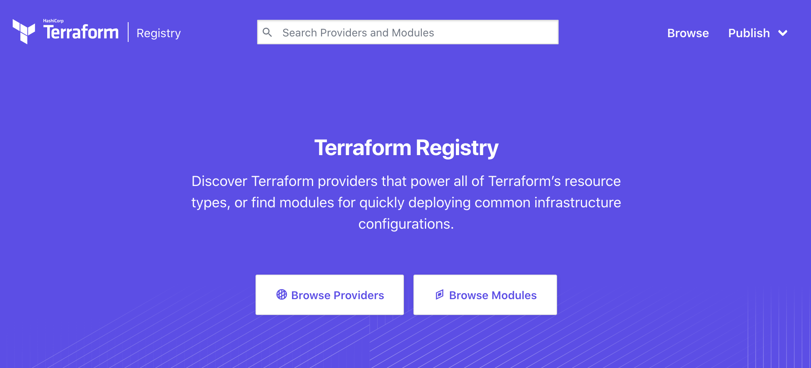
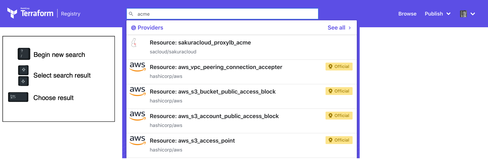
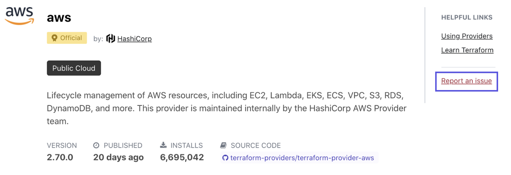

# Publishing Providers and Modules on the Terraform Registry

The [Terraform Registry](https://registry.terraform.io) is an interactive resource for discovering a wide selection of integrations (providers) and configuration packages (modules) for use with Terraform. The Registry includes solutions developed by HashiCorp, third-party vendors, and our Terraform community. Our goal with the Registry is to provide plugins to manage any infrastructure API, pre-made modules to quickly configure common infrastructure components, and examples of how to write quality Terraform code.

The Terraform Registry is integrated [directly into Terraform](/docs/configuration/provider-requirements.html) so you can directly specify providers and modules. Anyone can publish and consume providers and modules on the public [Terraform Registry](https://registry.terraform.io). (To publish private modules within your organization, you can use a [private registry](/docs/registry/private.html) or [reference repositories and other sources directly](/docs/modules/sources.html).)

Use the navigation to the left to learn more about using the Terraform Registry.

## Navigating the Registry

The registry has a number of different categories for both modules and providers to help with navigating the large number of available options. Select a provider or module card to learn more, filter results to a [specific tier](./providers/index.html#provider-tiers-amp-namespaces), or use the search field at the top of the Registry to find what you’re looking for. (Note that search supports keyboard navigation.)

## User Account

Anyone interested in publishing a provider or module can create an account and sign in to the Terraform Registry using a GitHub account. Click the "Sign-in" button, and follow the login prompts. Once you have authorized the use of your GitHub account and are signed in, you can publish both providers and modules directly from one of the repositories you manage. To learn more, see [Publishing to the Registry](/docs/registry/providers/publishing.html).

## Getting Help

We welcome any feedback about using or publishing to the Registry. Please reach out if you have any questions or issues with the Terraform Registry by sending us an [email](mailto:terraform-registry-beta@hashicorp.com). The providers and modules in The Terraform Registry are published and maintained either directly by HashiCorp, by trusted HashiCorp partners, or by members of the Terraform community ([see tiers & namespaces](./providers/index.html#provider-tiers-amp-namespaces)). If you run into issues or have additional contributions to make to a provider or module, you can submit a GitHub issue by selecting the "Report an issue" link on the detail view:

