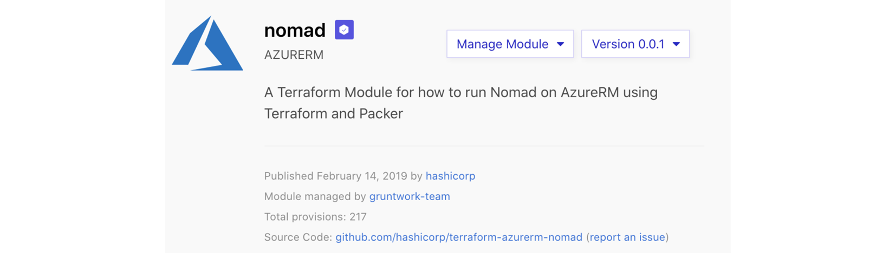

# Verified Modules

Verified modules are reviewed by HashiCorp and actively maintained by contributors to stay up-to-date and compatible with both Terraform and their respective providers.

The verified badge appears next to modules that are published by a verified source.

Verified modules are expected to be actively maintained by HashiCorp partners.
The verified badge isn’t indicative of flexibility or feature support; very
simple modules can be verified just because they're great examples of modules.
Likewise, an unverified module could be extremely high quality and actively
maintained. An unverified module shouldn't be assumed to be poor quality, it
only means it hasn't been created by a HashiCorp partner.

When [using registry modules](/docs/registry/modules/use.html), there is no
difference between a verified and unverified module; they are used the same
way.
