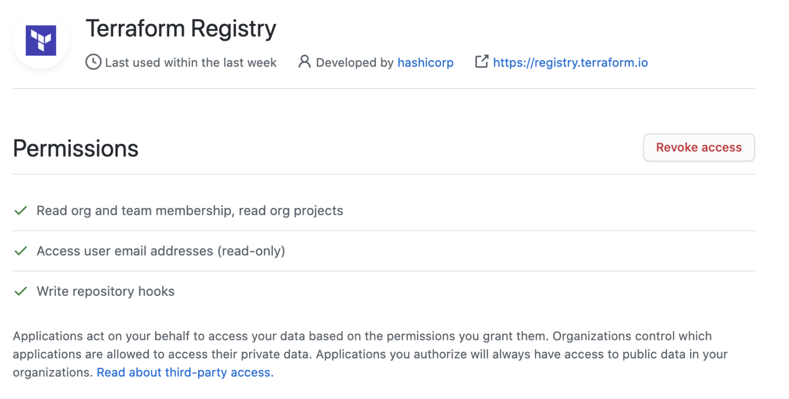

# Publishing Providers

Anyone can publish and share a provider by signing into the Registry using their GitHub account and following a few easy steps.

This page describes how to prepare a [Terraform Provider](/docs/plugins/provider.html) for publishing, and how to publish a prepared provider using the Registry's interface.

## Preparing your Provider

### Writing a Provider

Providers published to the Terraform Registry are written and built in the same way as other Terraform providers. A variety of resources are available to help our contributors build a quality integration:

- The [Call APIs with Terraform Providers](https://learn.hashicorp.com/collections/terraform/providers?utm_source=WEBSITE&utm_medium=WEB_IO&utm_offer=ARTICLE_PAGE&utm_content=DOCS) collection on HashiCorp Learn
- [How to build a provider – Video](https://www.youtube.com/watch?v=2BvpqmFpchI)
- [Sample provider developed by a HashiCorp partner](https://blog.container-solutions.com/write-terraform-provider-part-1)
- Example providers for reference:
    - [AWS](https://github.com/terraform-providers/terraform-provider-aws)
    - [AzureRM](https://github.com/terraform-providers/terraform-provider-azurerm)
- [Contributing to Terraform guidelines](/docs/extend/community/contributing.html)

~> **Important:** In order to be detected by the Terraform Registry, all provider repositories on GitHub must match the pattern `terraform-provider-{NAME}`, and the repository must be public.

### Documenting your Provider

Your provider should contain an overview document (index.md), as well as a doc for each resource and data-source. See [Documenting Providers](./docs.html) for details about how to ensure your provider documentation renders properly on the Terraform Registry.

-> **Note:** In order to test how documents will render in the Terraform Registry, you can use the [Terraform Registry Doc Preview Tool](https://registry.terraform.io/tools/doc-preview).

### Creating a GitHub Release

Publishing a provider requires at least one version be available on GitHub Releases. The tag must be a valid [Semantic Version](https://semver.org/) preceded with a `v` (for example, `v1.2.3`).

Terraform CLI and the Terraform Registry follow the Semantic Versioning specification when detecting a valid version, sorting versions, solving version constraints, and choosing the latest version. Prerelease versions are supported (available if explicitly defined but not chosen automatically) with a hyphen (-) delimiter, such as `v1.2.3-pre`.

We have a list of [recommend OS / architecture combinations](/docs/registry/providers/os-arch.html) for which we suggest most providers create binaries.

~> **Important:** Avoid modifying or replacing an already-released version of a provider, as this will cause checksum errors for users when attempting to download the plugin. Instead, if changes are necessary, please release as a new version.

#### GitHub Actions (Preferred)

[GitHub Actions](https://docs.github.com/en/actions) allow you to execute workflows when events on your repository occur. You can use this to publish provider releases to the Terraform Registry whenever a new version tag is created on your repository.

To use GitHub Actions to publish new provider releases to the Terraform Registry:

1. Create and export a signing key that you plan on using to sign your provider releases. See [Preparing and Adding a Signing Key](#preparing-and-adding-a-signing-key) for more information.
1. Copy the [GoReleaser configuration from the terraform-provider-scaffolding repository](https://github.com/hashicorp/terraform-provider-scaffolding/blob/master/.goreleaser.yml) to the root of your repository.
1. Copy the [GitHub Actions workflow from the terraform-provider-scaffolding repository](https://github.com/hashicorp/terraform-provider-scaffolding/blob/master/.github/workflows/release.yml) to `.github/workflows/release.yml` in your repository.
1. Go to *Settings > Secrets* in your repository, and add the following secrets:
  * `GPG_PRIVATE_KEY` - Your ASCII-armored GPG private key. You can export this with `gpg --armor --export-secret-keys [key ID or email]`.
  * `PASSPHRASE` - The passphrase for your GPG private key.
1. Push a new valid version tag (e.g. `v1.2.3`) to test that the GitHub Actions releaser is working.

Once a release is created, you can move on to [Publishing to the Registry](#publishing-to-the-registry).

#### Using GoReleaser locally

GoReleaser is a tool for building Go projects for multiple platforms, creating a checksums file, and signing the release. It can also upload your release to GitHub Releases.

1. Install [GoReleaser](https://goreleaser.com) using the [installation instructions](https://goreleaser.com/install/).
1. Copy the [.goreleaser.yml file](https://github.com/hashicorp/terraform-provider-scaffolding/blob/master/.goreleaser.yml) from the [hashicorp/terraform-provider-scaffolding](https://github.com/hashicorp/terraform-provider-scaffolding) repository.
1. Cache the password for your GPG private key with `gpg --armor --detach-sign` (see note below).
1. Set your `GITHUB_TOKEN` to a [Personal Access Token](https://github.com/settings/tokens/new?scopes=public_repo) that has the **public_repo** scope.
1. Tag your version with `git tag v1.2.3`.
1. Build, sign, and upload your release with `goreleaser release --rm-dist`.

-> GoReleaser does not support signing binaries with a GPG key that requires a passphrase. Some systems may cache your GPG passphrase for a few minutes. If you are unable to cache the passphrase for GoReleaser, please use the manual release preparation process below, or remove the signature step from GoReleaser and sign it prior to moving the GitHub release from draft to published.

#### Manually Preparing a Release

If for some reason you're not able to use GoReleaser to build, sign, and upload your release, you can create the required assets by following these steps, or encode them into a Makefile or shell script.

The release must meet the following criteria:

* There are 1 or more zip files containing the built provider binary for a single architecture
    * The binary name is `terraform-provider-{NAME}_v{VERSION}`
    * The archive name is `terraform-provider-{NAME}_{VERSION}_{OS}_{ARCH}.zip`
* There is a `terraform-provider-{NAME}_{VERSION}_SHA256SUMS` file, which contains a sha256 sum for each zip file in the release.
    * `shasum -a 256 *.zip > terraform-provider-{NAME}_{VERSION}_SHA256SUMS`
* There is a `terraform-provider-{NAME}_{VERSION}_SHA256SUMS.sig` file, which is a valid GPG signature of the `terraform-provider-{NAME}_{VERSION}_SHA256SUMS` file using the keypair.
    * `gpg --detach-sign terraform-provider-{NAME}_{VERSION}_SHA256SUMS`
* Release is finalized (not a private draft).

## Publishing to the Registry

### Signing in

Before publishing a provider, you must first sign in to the Terraform Registry with a GitHub account (see [Signing into the Registry](/docs/registry/index.html#creating-an-account)). The GitHub account used must have the following permission scopes on the provider repository you’d like to publish. Permissions can be verified by going to your [GitHub Settings](https://github.com/settings/connections/applications/) and selecting the Terraform Registry Application under Authorized OAuth Apps.



### Preparing and Adding a Signing Key

All provider releases are required to be signed, thus you must provide HashiCorp with the public key for the GPG keypair that you will be signing releases with. The Terraform Registry will validate that the release is signed with this key when publishing each version, and Terraform will verify this during `terraform init`.

- Generate a GPG key to be used when signing releases (See [GitHub's detailed instructions](https://docs.github.com/en/github/authenticating-to-github/generating-a-new-gpg-key) for help with this step, but you do not need to add the key to GitHub)
- Export your public key in ASCII-armor format using the following command, substituting the GPG key ID created in the step above:

```console
$ gpg --armor --export "{Key ID or email address}"
```

The ASCII-armored public key to the Terraform Registry by going to [User Settings > Signing Keys](https://registry.terraform.io/settings/gpg-keys). You can add keys for your personal namespace, or any organization which you are an admin of.


### Publishing Your Provider

In the top-right navigation, select [Publish > Provider](https://registry.terraform.io/publish/provider) to begin the publishing process. Follow the prompts to select the organization and repository you would like to publish.

#### Terms of Use

Anything published to the Terraform Registry is subject to our terms of use. A copy of the terms are available for viewing at https://registry.terraform.io/terms

### Support

If you experience issues publishing your provider to the Terraform Registry, please contact us at [terraform-registry@hashicorp.com](mailto:terraform-registry@hashicorp.com).
